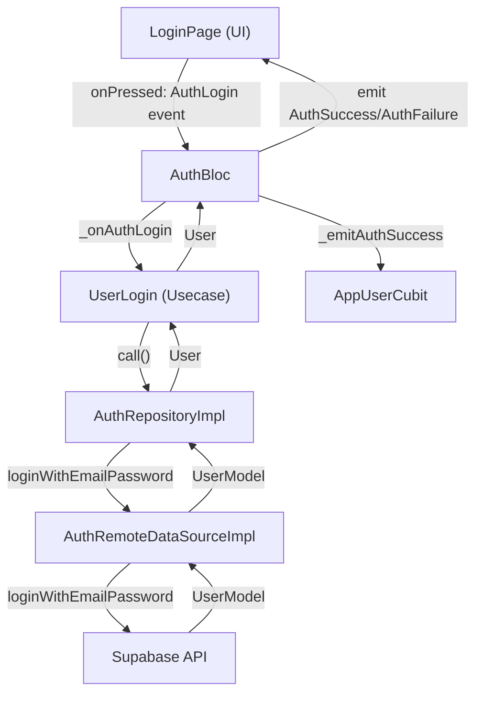

## 1. Flow đi qua từng file (theo thứ tự thực thi)

### **Bước 1: Giao diện người dùng (UI)**

- **File:** `lib/features/auth/presentation/pages/login_page.dart`
  - Người dùng nhập email, password và nhấn nút "Sign in".
  - Hàm `onPressed` của `AuthButton` kiểm tra form, sau đó gọi:
    ```dart
    context.read<AuthBloc>().add(AuthLogin(email: ..., password: ...));
    ```

### **Bước 2: Bloc xử lý sự kiện**

- **File:** `lib/features/auth/presentation/bloc/auth_bloc.dart`
  - Nhận event `AuthLogin`.
  - Gọi hàm `_onAuthLogin`, truyền dữ liệu vào usecase `UserLogin`.

### **Bước 3: Usecase nghiệp vụ**

- **File:** `lib/features/auth/domain/usecases/user_login.dart`
  - Hàm `call` thực hiện validate cơ bản (nếu có), sau đó gọi repository:
    ```dart
    authRepository.loginWithEmailPassword(email: ..., password: ...)
    ```

### **Bước 4: Repository (Xử lý logic, kiểm tra kết nối, gọi data source)**

- **File:** `lib/features/auth/data/repositories/auth_repository_impl.dart`
  - Hàm `loginWithEmailPassword` kiểm tra kết nối mạng (bằng `connectionChecker`).
  - Gọi hàm cùng tên ở data source:
    ```dart
    remoteDataSource.loginWithEmailPassword(email: ..., password: ...)
    ```

### **Bước 5: Data Source (Tương tác với Supabase)**

- **File:** `lib/features/auth/data/datasources/auth_remote_data_source.dart`
  - Hàm `loginWithEmailPassword` gọi Supabase API để đăng nhập.
  - Xử lý lỗi, trả về model người dùng.

### **Bước 6: Model & Entity**

- **File:** `lib/features/auth/data/models/user_model.dart`, `lib/core/common/entities/user.dart`
  - Chuyển đổi dữ liệu trả về thành đối tượng `UserModel`/`User`.

### **Bước 7: Bloc cập nhật trạng thái**

- **File:** `lib/features/auth/presentation/bloc/auth_bloc.dart`
  - Nếu thành công, gọi `_emitAuthSuccess`, cập nhật user vào `AppUserCubit`, emit state `AuthSuccess`.
  - Nếu thất bại, emit state `AuthFailure`.

### **Bước 8: Cubit lưu trạng thái user**

- **File:** `lib/core/common/cubits/app_user/app_user_cubit.dart`
  - Hàm `updateUser` cập nhật trạng thái đăng nhập toàn app.

### **Bước 9: UI nhận state mới**

- **File:** `lib/features/auth/presentation/pages/login_page.dart`
  - BlocConsumer lắng nghe state, hiển thị thông báo thành công/thất bại, điều hướng nếu cần.

---

## 2. Trong mỗi file, liệt kê các hàm được gọi và vai trò

### **a. `login_page.dart`**

- **`onPressed` của AuthButton:** Lấy dữ liệu từ form, validate, gửi event `AuthLogin` cho Bloc.

### **b. `auth_bloc.dart`**

- **`_onAuthLogin`:** Nhận event, gọi usecase `UserLogin`.
- **`_emitAuthSuccess`:** Cập nhật user vào `AppUserCubit`, emit state `AuthSuccess`.
- **`emit(AuthFailure)`:** Khi đăng nhập thất bại.

### **c. `user_login.dart`**

- **`call`:** Gọi repository để thực hiện đăng nhập.

### **d. `auth_repository_impl.dart`**

- **`loginWithEmailPassword`:** Kiểm tra kết nối mạng, gọi data source để đăng nhập.
- **`_getUser`:** Xử lý logic chung cho các thao tác trả về user (dùng cho cả đăng nhập và đăng ký).

### **e. `auth_remote_data_source.dart`**

- **`loginWithEmailPassword`:** Gọi Supabase API để đăng nhập, xử lý lỗi trả về từ Supabase.

### **f. `app_user_cubit.dart`**

- **`updateUser`:** Cập nhật trạng thái user toàn app.

### **g. `auth_field.dart` (helper)**

- **`validator` trong `AuthField`:** Validate dữ liệu nhập ở UI (email, password).

---

## 3. Các file/hàm hỗ trợ liên quan

- **`auth_field.dart`:** Validate dữ liệu form ở UI.
- **`connection_checker.dart`:** Kiểm tra kết nối mạng trước khi gọi API.
- **`exceptions.dart`, `failures.dart`:** Định nghĩa và xử lý lỗi.
- **`init_dependencies.dart`:** Đăng ký dependency injection cho các lớp trên.

---

## 4. Điều kiện logic, pipeline hoặc event tác động

- **Validation ở nhiều lớp:** UI (`AuthField`), Usecase (nếu có), DataSource (`AuthRemoteDataSourceImpl.loginWithEmailPassword`).
- **Kiểm tra kết nối mạng:** Ở repository.
- **Xử lý lỗi chi tiết:** DataSource phân biệt lỗi email, password, mạng, v.v.
- **Event pipeline:** UI → Bloc Event → Usecase → Repository → DataSource → Supabase → Repository → Usecase → Bloc State → UI.

---

## 5. Sơ đồ flow (dạng danh sách thứ tự)



---

## 6. Overview ngắn gọn

**Chức năng Đăng Nhập** trong hệ thống này vận hành theo pipeline chuẩn của Clean Architecture:  
Người dùng nhập thông tin → UI gửi event cho Bloc → Bloc gọi Usecase để xử lý nghiệp vụ → Repository kiểm tra kết nối, gọi DataSource → DataSource tương tác với Supabase để đăng nhập → Kết quả trả về qua các lớp, cập nhật trạng thái user toàn app và phản hồi lại UI.  
Validation và xử lý lỗi được thực hiện ở nhiều lớp để đảm bảo tính toàn vẹn và trải nghiệm người dùng.

---

Nếu bạn muốn phân tích sâu hơn vào bất kỳ lớp/hàm nào, hãy cho mình biết!
