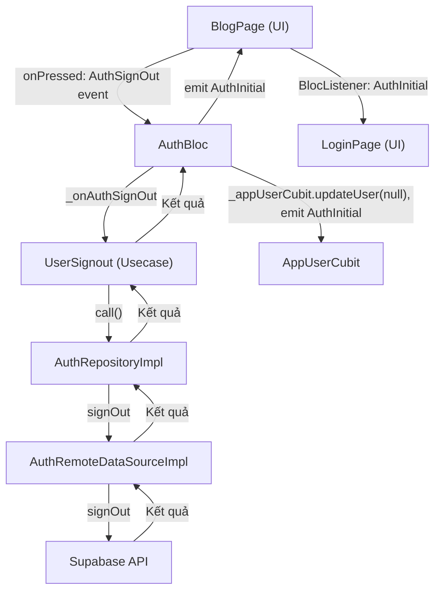

## 1. Flow đi qua từng file (theo thứ tự thực thi)

### **Bước 1: UI (Giao diện người dùng)**

- **File:** `lib/features/blog/presentation/pages/blog_page.dart`
  - Khi người dùng nhấn nút logout (`IconButton` trên AppBar), hàm `onPressed` được gọi:
    ```dart
    context.read<AuthBloc>().add(AuthSignOut());
    ```
  - Gửi event `AuthSignOut` tới Bloc.

---

### **Bước 2: Bloc xử lý sự kiện**

- **File:** `lib/features/auth/presentation/bloc/auth_bloc.dart`
  - Bloc nhận event `AuthSignOut`.
  - Gọi hàm `_onAuthSignOut`:
    ```dart
    void _onAuthSignOut(AuthSignOut event, Emitter<AuthState> emit) async {
      final res = await _userSignOut(NoParams());
      res.fold((failure) => emit(AuthFailure(failure.message)), (_) {
        _appUserCubit.updateUser(null);
        emit(AuthInitial());
      });
      emit(AuthInitial());
    }
    ```
  - Gọi usecase `UserSignout`, xử lý kết quả, cập nhật trạng thái user và emit state `AuthInitial`.

---

### **Bước 3: Usecase nghiệp vụ**

- **File:** `lib/features/auth/domain/usecases/user_signout.dart`
  - Hàm `call` thực thi:
    ```dart
    Future<Either<Failure, User>> call(NoParams params) {
      return authRepository.signOut().then((result) {
        return result.fold(
          (failure) => left(failure),
          (_) async {
            return await authRepository.currentUser();
          },
        );
      });
    }
    ```
  - Gọi repository `signOut()`, nếu thành công thì lấy lại thông tin user hiện tại (thường là null sau khi sign out).

---

### **Bước 4: Repository (Xử lý logic, kiểm tra kết nối, gọi data source)**

- **File:** `lib/features/auth/data/repositories/auth_repository_impl.dart`
  - Hàm `signOut`:
    ```dart
    Future<Either<Failure, void>> signOut() async {
      try {
        if (!await (connectionChecker.isConnected)) {
          return left(Failure(Constants.noConnectionErrorMessage));
        }
        remoteDataSource.signOut();
        return right(null);
      } on ServerException catch (e) {
        return left(Failure(e.message));
      }
    }
    ```
  - Kiểm tra kết nối mạng, gọi `remoteDataSource.signOut()`, xử lý lỗi nếu có.

---

### **Bước 5: Data Source (Tương tác với Supabase)**

- **File:** `lib/features/auth/data/datasources/auth_remote_data_source.dart`
  - Hàm `signOut`:
    ```dart
    Future<void> signOut() {
      try {
        return supabaseClient.auth.signOut();
      } on AuthException catch (e) {
        throw ServerException(e.message);
      } catch (e) {
        throw ServerException(e.toString());
      }
    }
    ```
  - Gọi API của Supabase để đăng xuất, xử lý lỗi nếu có.

---

### **Bước 6: Bloc cập nhật trạng thái & UI điều hướng**

- **File:** `lib/features/auth/presentation/bloc/auth_bloc.dart`

  - Sau khi sign out thành công, gọi:
    ```dart
    _appUserCubit.updateUser(null);
    emit(AuthInitial());
    ```
  - Cập nhật trạng thái user toàn app về null, emit state `AuthInitial`.

- **File:** `lib/features/blog/presentation/pages/blog_page.dart`
  - BlocListener lắng nghe state `AuthInitial`:
    ```dart
    if (state is AuthInitial) {
      Navigator.pushAndRemoveUntil(
        context,
        MaterialPageRoute(builder: (context) => const LoginPage()),
        (route) => false,
      );
    }
    ```
  - Điều hướng về trang đăng nhập.

---

## 2. Trong mỗi file, liệt kê các hàm được gọi và vai trò

| File                           | Hàm                      | Vai trò                                   |
| ------------------------------ | ------------------------ | ----------------------------------------- |
| `blog_page.dart`               | `onPressed` (IconButton) | Gửi event `AuthSignOut`                   |
| `auth_bloc.dart`               | `_onAuthSignOut`         | Nhận event, gọi usecase, cập nhật state   |
| `user_signout.dart`            | `call`                   | Gọi repository để sign out, lấy lại user  |
| `auth_repository_impl.dart`    | `signOut`                | Kiểm tra mạng, gọi data source, xử lý lỗi |
| `auth_remote_data_source.dart` | `signOut`                | Gọi Supabase API đăng xuất                |
| `app_user_cubit.dart`          | `updateUser`             | Cập nhật trạng thái user toàn app         |
| `blog_page.dart`               | BlocListener             | Lắng nghe state, điều hướng về LoginPage  |

---

## 3. Các file/hàm hỗ trợ liên quan

- **`connection_checker.dart`**: Kiểm tra kết nối mạng trước khi gọi API.
- **`exceptions.dart`, `failures.dart`**: Định nghĩa và xử lý lỗi.
- **`init_dependencies.dart`**: Đăng ký dependency injection cho các lớp trên.
- **`app_user_cubit.dart`**: Quản lý trạng thái user toàn app.

---

## 4. Điều kiện logic, pipeline, event tác động

- **Kiểm tra kết nối mạng:** Ở repository, nếu mất mạng sẽ trả về lỗi.
- **Xử lý lỗi:** DataSource và repository đều bắt và chuyển lỗi về dạng Failure.
- **Event pipeline:** UI → Bloc Event → Usecase → Repository → DataSource → Supabase → Repository → Usecase → Bloc State → UI.
- **State pipeline:** Sau khi sign out, state chuyển về `AuthInitial`, UI điều hướng về LoginPage.

---

## 5. Sơ đồ flow (dạng danh sách thứ tự)



---

## 6. Overview ngắn gọn

**Chức năng Đăng xuất (Sign Out)** vận hành theo pipeline chuẩn của Clean Architecture:  
Người dùng nhấn nút logout → UI gửi event cho Bloc → Bloc gọi Usecase → Usecase gọi Repository kiểm tra mạng, gọi DataSource → DataSource gọi Supabase API để đăng xuất → Kết quả trả về qua các lớp, cập nhật trạng thái user toàn app về null, emit state `AuthInitial` → UI lắng nghe state và điều hướng về trang đăng nhập.  
Tất cả lỗi và điều kiện logic đều được xử lý ở các lớp thích hợp để đảm bảo trải nghiệm người dùng và tính toàn vẹn hệ thống.

---

Nếu bạn muốn phân tích sâu hơn vào bất kỳ lớp/hàm nào, hãy cho mình biết!
