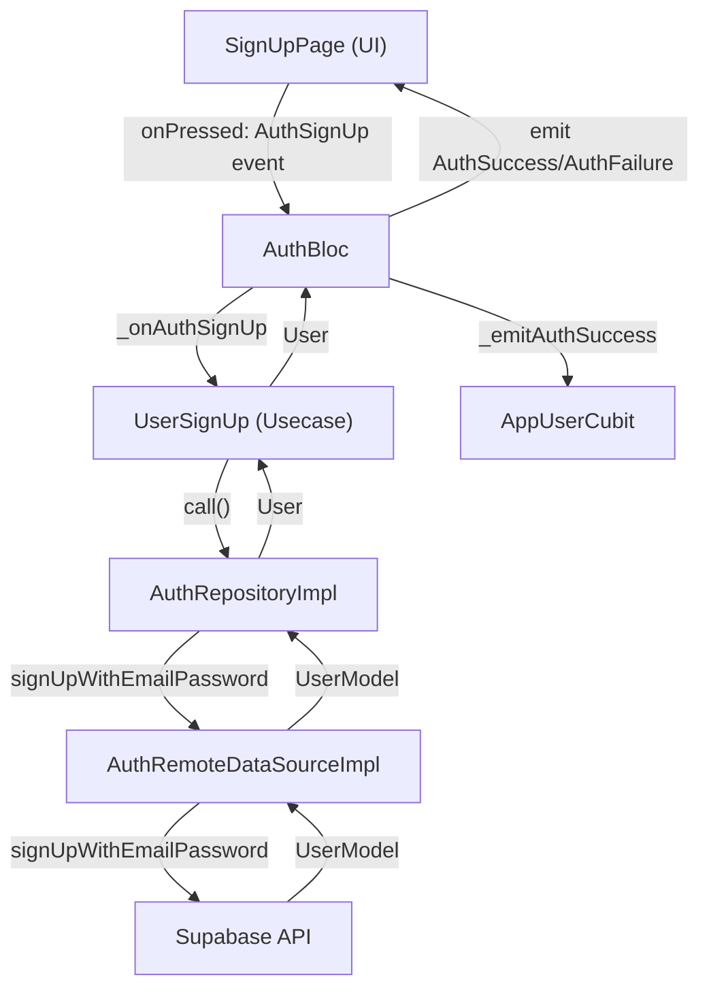

## 1. Flow đi qua từng file (theo thứ tự thực thi)

### 1. Giao diện người dùng (UI)

- **File:** `lib/features/auth/presentation/pages/signup_page.dart`
  - Người dùng nhập thông tin (name, email, password) và nhấn nút "Sign Up".
  - Gọi: `context.read<AuthBloc>().add(AuthSignUp(...))`

### 2. Bloc xử lý sự kiện

- **File:** `lib/features/auth/presentation/bloc/auth_bloc.dart`
  - Nhận event `AuthSignUp`.
  - Gọi hàm `_onAuthSignUp`, truyền dữ liệu vào usecase `UserSignUp`.

### 3. Usecase nghiệp vụ

- **File:** `lib/features/auth/domain/usecases/user_sign_up.dart`
  - Hàm `call` thực hiện validate dữ liệu (email, password, name).
  - Nếu hợp lệ, gọi tiếp repository: `authRepository.signUpWithEmailPassword(...)`.

### 4. Repository (Xử lý logic, kiểm tra kết nối, gọi data source)

- **File:** `lib/features/auth/data/repositories/auth_repository_impl.dart`
  - Hàm `signUpWithEmailPassword` kiểm tra kết nối mạng.
  - Gọi hàm cùng tên ở data source: `remoteDataSource.signUpWithEmailPassword(...)`.

### 5. Data Source (Tương tác với Supabase)

- **File:** `lib/features/auth/data/datasources/auth_remote_data_source.dart`
  - Hàm `signUpWithEmailPassword` gọi Supabase API để đăng ký tài khoản.
  - Xử lý lỗi, trả về model người dùng.

### 6. Model & Entity

- **File:** `lib/features/auth/data/models/user_model.dart`, `lib/core/common/entities/user.dart`
  - Chuyển đổi dữ liệu trả về thành đối tượng `UserModel`/`User`.

### 7. Bloc cập nhật trạng thái

- **File:** `lib/features/auth/presentation/bloc/auth_bloc.dart`
  - Nếu thành công, gọi `_emitAuthSuccess`, cập nhật user vào `AppUserCubit`, emit state `AuthSuccess`.
  - Nếu thất bại, emit state `AuthFailure`.

### 8. Cubit lưu trạng thái user

- **File:** `lib/core/common/cubits/app_user/app_user_cubit.dart`
  - Hàm `updateUser` cập nhật trạng thái đăng nhập toàn app.

### 9. UI nhận state mới

- **File:** `lib/features/auth/presentation/pages/signup_page.dart`
  - BlocConsumer lắng nghe state, hiển thị thông báo thành công/thất bại.

---

## 2. Chi tiết từng file, hàm và vai trò

### a. `signup_page.dart`

- **Hàm:** `onPressed` của `AuthButton`
  - Lấy dữ liệu từ form, validate, gửi event `AuthSignUp` cho Bloc.

### b. `auth_bloc.dart`

- **Hàm:** `_onAuthSignUp`
  - Nhận event, gọi usecase `UserSignUp`.
  - Nhận kết quả, emit state `AuthSuccess` hoặc `AuthFailure`.
- **Hàm:** `_emitAuthSuccess`
  - Cập nhật user vào `AppUserCubit`.

### c. `user_sign_up.dart`

- **Hàm:** `call`
  - Validate dữ liệu đầu vào (email, password, name).
  - Gọi repository để thực hiện đăng ký.

### d. `auth_repository_impl.dart`

- **Hàm:** `signUpWithEmailPassword`
  - Kiểm tra kết nối mạng.
  - Gọi data source để đăng ký.
- **Hàm:** `_getUser`
  - Xử lý logic chung cho các thao tác trả về user.

### e. `auth_remote_data_source.dart`

- **Hàm:** `signUpWithEmailPassword`
  - Gọi Supabase API để đăng ký.
  - Xử lý lỗi trả về từ Supabase.

### f. `app_user_cubit.dart`

- **Hàm:** `updateUser`
  - Cập nhật trạng thái user toàn app.

### g. `auth_field.dart` (helper)

- **Hàm:** `validator` trong `AuthField`
  - Validate dữ liệu nhập ở UI (email, password).

---

## 3. Các file/hàm hỗ trợ liên quan

- **`auth_field.dart`**: Validate dữ liệu form ở UI.
- **`connection_checker.dart`**: Kiểm tra kết nối mạng trước khi gọi API.
- **`exceptions.dart`, `failures.dart`**: Định nghĩa và xử lý lỗi.
- **`init_dependencies.dart`**: Đăng ký dependency injection cho các lớp trên.

---

## 4. Điều kiện logic, pipeline, event tác động

- **Validation ở nhiều lớp**:
  - UI (`AuthField`), Usecase (`UserSignUp.call`), DataSource (`AuthRemoteDataSourceImpl.signUpWithEmailPassword`).
- **Kiểm tra kết nối mạng**: Ở repository.
- **Xử lý lỗi chi tiết**: DataSource phân biệt lỗi email, password, mạng, v.v.
- **Event pipeline**: UI → Bloc Event → Usecase → Repository → DataSource → Supabase → Repository → Usecase → Bloc State → UI.

---

## 5. Sơ đồ flow (dạng danh sách thứ tự)

---

## 6. Overview ngắn gọn

**Chức năng Đăng ký** trong hệ thống này vận hành theo pipeline chuẩn của Clean Architecture:  
Người dùng nhập thông tin → UI gửi event cho Bloc → Bloc gọi Usecase để validate và xử lý nghiệp vụ → Repository kiểm tra kết nối, gọi DataSource → DataSource tương tác với Supabase để đăng ký → Kết quả trả về qua các lớp, cập nhật trạng thái user toàn app và phản hồi lại UI.  
Validation và xử lý lỗi được thực hiện ở nhiều lớp để đảm bảo tính toàn vẹn và trải nghiệm người dùng.

---

Nếu bạn muốn phân tích sâu hơn vào bất kỳ lớp/hàm nào, hãy cho mình biết!
